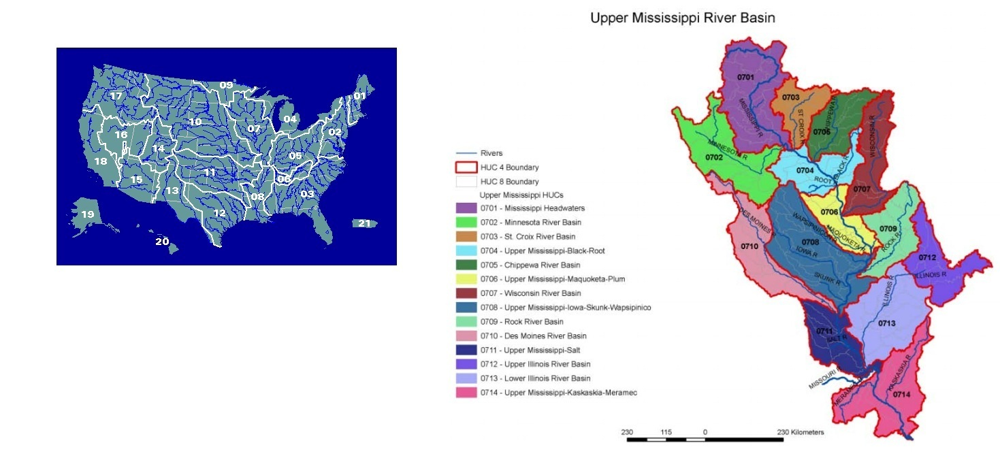
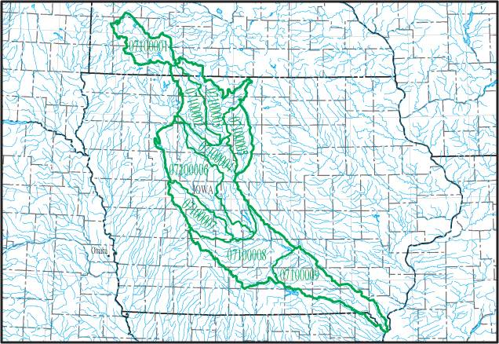

Draft of plan for the STAT 585X project
=======================================
by Andreea Erciulescu

Topic
-----
<!--- Auxiliary Information for Modeling Survey Data --> 
Changes in cultivated cropland soil in Iowa  

Questions of interest
---------------------
<!--- What sources of auxiliary variables are available to help explain variability in soil erosion? -->

Do soil characteristics changes over time match the Conservation Effects Assessement Project (CEAP) survey design and data collection?

Motivation
----------
National Resources Inventory (NRI) is an annual survey conducted collaboratively by USDA NRCS (Natural Resources Conservation Services) and ISU Center for Survey Statistics and Methodology (CSSM) to provide status and trend estimates for natural resources on nonfederal lands in US. Example of such estimates are soil erosion estimates in relation to land characteristics and programs.

Conservation Effects Assessment Project (CEAP) is a series of surveys intended to quantify environmental effects of conservation prctices and programs by hydrologic unit codes (HUCs). The following image illustrates the division of the United States territory into 2-digits HUCs and the sudivision of the Upper Mississippi region into 4-digit HUCs.  

The CEAP sample is a subset of the NRI points classified as cultivated cropland. The data was collected using farmers interviews and NRCS hydrologic, climate and soil databases. The data was then filtered through an APEX model (black box) and the result is a set of observations for usable points for 19 response variables. The final goal is to produce erosion estimates for 8-digit HUCs. 

CEAP is run at both national and regional levels. Among the regional levels, the Des Moines River Watershed (HUC 0710) is a region of interest in this project, that is subdivided into 9 8-digit HUCs.

<!---    -->

For analysis, data from the Soil Survey is considered, collected over the 2003 to 2006 time period. Hence, the survey frame, consisting of NRI cultivated cropland points, is set in 2003. The information for these eligible points is collected in the following years, 2004-2007.

<!--- In order to do modeling, we need a set of auxiliary variables, hopefully, presenting good correlations with the response variables we have from the APEX model. The first source of auxiliary variables was the NRI Pointgen data on land use and variables related to erosion (such as USLE erosion). The second source of auxiliary variables was the Soil Survey and we obtained information for the following soil characteristics: Rfactor, Kfactor, Wfactor, Hydrologic Group and Slope. In our analysis, slope seemed to have some extreme values and there were significant differences between the sample distribution and the population distribution. Hence, the motivation for searching for other soil characteristics to serve as covariates in the models. -->

Data
----

The CEAP sample data for the Des Moines River Watershed (HUC 0710) region is not publicly available, so in the class project I will consider the following sources of information:

  * Crop Data Layer (CDL)
  * Census Topologically Integrated Geographic Encoding and Referencing database (Tigerweb) 

The CDL data is available at [CDL] ([http://nassgeodata.gmu.edu/CropScape/]) in the form of Tagged Image File (.tif) Format. We are interested in the state of Iowa data, available for the years of 2003-2007. The information consists of pixel counts and acreage values for different category of cropland data. Each of the category has an associated value (code), for example 1 stands for Corn and 5 stands for Soybean. A complete list of category codes, class names and colors for the USDA NASS CDL is available at [Codes] ([http://www.nass.usda.gov/research/Cropland/docs/CDL_2013_crosswalk.htm]).

The Census Tigerweb data is available at [Census] ([http://tigerweb.geo.census.gov/tigerwebmain]) for both national and regional leveles. Also, data for the hydrologic levels is available at [HydroCensus] ([http://tigerweb.geo.census.gov/tigerwebmain/Files/tigerweb_tab10_hydro_poly_ia.html]). We are interested in the state of Iowa data, as well as the Des Moines River data. In particular, we are interested in the points coordinates. 

Other useful sources would be:
  * Public Land Survey System (PLSS)
  * GIS data on hydrologic basins
  * Atlas of historical countyu boundaries (AtlasHCB)

The PLSS data can be found on [PLSS]([http://http://www.geocommunicator.gov/GeoComm/lsis_home/home/index.htm]) in the form of shapefiles. Information is available at both state and county levels.  

The GIS data can be found at [GIS]([ftp://ftp.igsb.uiowa.edu/gis_library/basins/]) in the form of shapefiles. Information is available for the entire Des Moines River basin.

The AtlasHCB data is available at [AtlasHCB]([http://publications.newberry.org/ahcbp/pages/Iowa.html]) in the form of shapefiles. Information os available for the entire state of Iowa.

Data Collection and Processing Steps
------------------------------------

The plan is to explore all these different data sources and decide on the most useful one. We are interested in a very specific region in the state of Iowa so we would have to be careful at utilizing the data. Also, the files have very large dimensions, so we would have to be careful at selecting the amount of useful information.

* Census data

We are going to pull the Iowa data and the Des Moines River data from the web using the XML library in R, as we learnt in class. We will have to pull the coordinates for all the points and do some data processing to get the information in desired format, such as a dataframe containing the numeric values for the points coordinates. The data for the Des Moines River will have to be pulled from the full dataframe on the hydrologic levels in Iowa. Again, we would like to have a final product in the form of a dataframe, with numeric values for the point coordinates.

The plyr package in R with come handy at creating the region of interest around the Des Moiner River. This is necessary because the census data on the river contains only a few points, but CEAP was run at more points in the entire watershed. We will have to replicate a region to give us the necessary information, representative for the Des Moines River watershed.

* CDL data

In order to read in this data, we will use the Raster package in R. Since this was not covered in class, we are going to investigate it in depth to see how to make a use of it. Useful skills developed in this class would be accessing functions in a package and subfunctions that are called in other functions. We will also use the debuging function and other ways of tracking function calls in order to properly understand the use of the raster package (what functions to use, what arguments to give to the functions and so on). 

* PLSS, GIS, AtlasHCB data

We are going to read in these data using the maptools library in R, as we did in class. We extract the polygons information from these shapefiles using functions presented in class. Also, we could use the function developed in one of the labs in order to read in the polygon information for all the counties in Iowa (as we did with the district in Australia).

Results
------------------------------------

We will have to extract the pixel count information available in the CDL data for the points with coordinates in the Census data. By doing this matching, we will construct summaries for all the categories (corn, soybean, etc) for the points in the region of interest. We will do this for the years 2003-2007 and we will report the tables for each year. The final comments would be on the changes in crop categories over this time period and the effect on the future analysis done with the CEAP data. 

